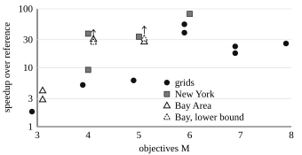

# FAST-MVH: Fast Adaptive Search with Trees for Multi-Valued Heuristic Search

### Abstract

Multi-valued heuristics describe trade-offs that a single lower-bound vector cannot represent, but using them requires many dominance checks. FAST-MVH reduces this cost while preserving every search decision of $L$-NAMOA$^*_{dr}$-mvh. It indexes expensive truncated frontiers with adaptive k-d trees, tests local dominance before selecting a heuristic, and confines the exact full-dimensional fallback to a set of evicted vectors that we prove sufficient. That set is append-only and is indexed by a lazily built forest of static k-d trees. On grids and road networks with three to eight objectives, it returns byte-identical solutions. It runs 1.8 to 4.1 times faster than the reference implementation with three objectives and up to 82 times faster with six, and it solves an eight-objective grid with 1,082,326 Pareto-optimal costs in three minutes.

## 1 Introduction

A shortest path need not be best in every objective. One route may be shorter while another is faster. Multi-objective search must therefore retain paths with incomparable costs, rather than one cheapest path per state. As the retained sets grow, testing whether a path is dominated can cost more than generating it.

Multi-valued heuristics (MVHs) address a different difficulty: weak lower bounds. Instead of one estimate, an MVH gives several estimates of the remaining cost, each describing a possible trade-off. This information can reduce search, but using it is not free. A path may test several heuristic vectors before finding one that the current solutions do not refute.

Wolff, Felner, and Salzman [1] combine MVHs with dimensionality reduction in $L$-NAMOA$^*_{dr}$-mvh. Each path carries one active heuristic vector. If a new solution refutes it, the algorithm selects the next one and reinserts the path. Local dominance is tested on truncated vectors when that suffices and on full vectors otherwise.

FAST-MVH keeps this algorithm and reduces the work needed to make its decisions. It changes three things: how frontiers are stored, the order of the two tests applied to a generated path, and the set that the exact full-dimensional test must search. It does not change the heuristic, the ordering of OPEN, or the Pareto set returned. Indexing truncated frontiers with dynamic k-d trees follows prior work on geometric dominance indexing [2]. The contributions here are its integration with lazy MVH evaluation and a provably sufficient, indexed fallback set.

## 2 Problem and Search Invariants

Let $G=(S,E,c)$ be a finite graph with $c(e)\in\mathbb{R}_{\geq0}^{M}$. Path costs are component-wise sums. A vector $x$ weakly dominates $y$, written $x\preceq y$, if $x_k\leq y_k$ for every $k$. The task is to return one path for each distinct non-dominated start-to-goal cost vector. Write $x<_{\mathrm{lex}}y$ for lexicographic order and

$$\operatorname{Tr}(x)=(x_2,\ldots,x_M).$$

An admissible MVH assigns a finite set $H(s)$ to each state: for every goal-reaching suffix $\pi$ from $s$, some $h\in H(s)$ satisfies $h\preceq c(\pi)$. We assume $H(s_{\mathrm{goal}})=\{0\}$ and the ordering used by [1]:

$$H(s)=\langle h^1,\ldots,h^{k(s)}\rangle,
\qquad h^1\leq_{\mathrm{lex}}\cdots\leq_{\mathrm{lex}}h^{k(s)}.$$

For genuine MVHs this order is a correctness precondition, not a traversal preference: the selected vector must be the first surviving member. No index may change that answer.

**Example.** Suppose two suffixes cost $(1,10)$ and $(10,1)$. The set of these vectors is admissible, but its component-wise maximum $(10,10)$ bounds neither suffix. If every vector bounded *every* suffix, as landmark bounds do, the maximum would be admissible. Genuine MVHs generally lack this property [3,4], so we never replace an MVH by its maximum.

A node $n$ records a state $s(n)$, path cost $g(n)$, heuristic index $i(n)$, and $f(n)=g(n)+h^{i(n)}$. OPEN is ordered lexicographically by $f$. Let $C(s)$ be the costs of paths expanded at $s$. The *reduced frontier* $F(s)\subseteq C(s)$ stores full vectors but is compared on truncations. Expanding $g$ at $s$ performs

$$F(s)\leftarrow
\{p\in F(s):\operatorname{Tr}(g)\npreceq\operatorname{Tr}(p)\}\cup\{g\}.$$

Let $T=F(s_{\mathrm{goal}})$. $F(s)$ need not be a full-dimensional Pareto set. Its required property is *coverage*: every $a\in C(s)$ has some $p\in F(s)$ with $\operatorname{Tr}(p)\preceq\operatorname{Tr}(a)$.

FAST-MVH also keeps a *residue* $R(s)\subseteq C(s)$. When an expansion with cost $g$ evicts $p$ from $F(s)$, $p$ enters $R(s)$ iff $p_1<g_1$. Otherwise $g\preceq p$ in all $M$ coordinates and $p$ is discarded. Vectors never leave $R(s)$, and $C(s)$ itself is not stored.

## 3 FAST-MVH

Algorithm 1 follows the node lifecycle of $L$-NAMOA$^*_{dr}$-mvh [1]: extract a node; if the goal frontier refutes its heuristic, select the next one and reinsert; otherwise test it locally, expand it, and generate successors. One step differs. At generation, the reference implementation selects a heuristic first and then tests local dominance. FAST-MVH tests local dominance first (lines 15--16).

**Algorithm 1: FAST-MVH**

**Input:** $G,s_{\mathrm{start}},s_{\mathrm{goal}}$ and ordered admissible $H$.  
**Output:** a cost-unique Pareto-optimal path set $\mathrm{Sols}$.

| | |
|--:|:--|
| 1 | $\mathrm{Sols}\leftarrow\emptyset;\quad F(s),R(s)\leftarrow\emptyset$ for all $s$ |
| 2 | $n\leftarrow(s_{\mathrm{start}},0,1)$; $\mathrm{parent}(n)\leftarrow\bot$ |
| 3 | $\mathrm{OPEN}\leftarrow\{n\}$ |
| 4 | **while** $\mathrm{OPEN}\ne\emptyset$ **do** |
| 5 | &emsp; $n\leftarrow\mathrm{OPEN.PopMin}()$ |
| 6 | &emsp; **if** $\mathrm{GoalDom}(f(n))$ **then** |
| 7 | &emsp;&emsp; $i\leftarrow\mathrm{ChooseH}(s(n),g(n),i(n)+1,\mathrm{true})$ |
| 8 | &emsp;&emsp; **if** $i\ne\bot$ **then** $i(n)\leftarrow i$; insert $n$ in OPEN |
| 9 | &emsp;&emsp; **continue** |
| 10 | &emsp; **if** $\mathrm{LocalDom}(s(n),g(n))$ **then continue** |
| 11 | &emsp; $\mathrm{Update}(s(n),g(n))$ |
| 12 | &emsp; **if** $s(n)=s_{\mathrm{goal}}$ **then** add $n$ to $\mathrm{Sols}$; **continue** |
| 13 | &emsp; **for each** $s'\in\mathrm{Succ}(s(n))$ **do** |
| 14 | &emsp;&emsp; $g'\leftarrow g(n)+c(s(n),s')$ |
| 15 | &emsp;&emsp; **if** $\mathrm{LocalDom}(s',g')$ **then continue** |
| 16 | &emsp;&emsp; $i'\leftarrow\mathrm{ChooseH}(s',g',1,\mathrm{false})$ |
| 17 | &emsp;&emsp; **if** $i'\ne\bot$ **then** insert $(s',g',i')$ with parent $n$ in OPEN |
| 18 | **return** $\mathrm{Sols}$ |

The two tests at generation are pure: neither changes a frontier. Their order therefore cannot change which successors enter OPEN. It changes only cost. $\mathrm{ChooseH}$ may query the goal frontier once per heuristic vector, while $\mathrm{LocalDom}$ usually decides with one frontier query. Testing first the predicate that is cheaper and prunes more often avoids selecting heuristics for paths that would be discarded anyway.

### 3.1 Dominance queries

Every frontier is stored in a k-d tree [5]. A node $v$ holds a few live vectors $P(v)$, at most two children, and the component-wise minimum $\ell(v)$ and maximum $u(v)$ of the vectors below it. An unindexed array is a single node. $\mathrm{Find}(\mathcal{K},q,\kappa)$ enumerates the members $p$ of a tree or forest $\mathcal{K}$ with $\kappa(p)\preceq q$, where $\kappa$ is $\operatorname{Tr}$ or the identity. It skips a subtree when $\kappa(\ell(v))\npreceq q$, because then no vector below $v$ can qualify. Callers stop it at the first useful answer.

**Algorithm 2: Dominance queries and update**

| | |
|--:|:--|
| 1 | **function** $\mathrm{Find}(\mathcal{K},q,\kappa)$ |
| 2 | &emsp; $\Sigma\leftarrow$ roots of $\mathcal{K}$ |
| 3 | &emsp; **while** $\Sigma\neq\emptyset$ **do** |
| 4 | &emsp;&emsp; pop $v$ from $\Sigma$; **if** $\kappa(\ell(v))\npreceq q$ **then continue** |
| 5 | &emsp;&emsp; **yield** each $p\in P(v)$ with $\kappa(p)\preceq q$ |
| 6 | &emsp;&emsp; push the children of $v$ on $\Sigma$ |
| 7 | **function** $\mathrm{GoalDom}(f)$ |
| 8 | &emsp; **return true** iff $\mathrm{Find}(T,\operatorname{Tr}(f),\operatorname{Tr})$ yields |
| 9 | **function** $\mathrm{LocalDom}(s,g)$ |
| 10 | &emsp; $w\leftarrow\mathrm{NONE}$ |
| 11 | &emsp; **for each** $p\in\mathrm{Find}(F(s),\operatorname{Tr}(g),\operatorname{Tr})$ **do** |
| 12 | &emsp;&emsp; **if** $p_1\le g_1$ **then return true** &emsp;&emsp;▷ $p\preceq g$ |
| 13 | &emsp;&emsp; $w\leftarrow\mathrm{TR}$ |
| 14 | &emsp; **if** $w=\mathrm{NONE}$ **then return false** |
| 15 | &emsp; **return true** iff $\mathrm{Find}(R(s),g,\mathrm{id})$ yields |
| 16 | **procedure** $\mathrm{Update}(s,g)$ |
| 17 | &emsp; **for each** $p\in F(s)$ with $\operatorname{Tr}(g)\preceq\operatorname{Tr}(p)$ **do** |
| 18 | &emsp;&emsp; remove $p$ from $F(s)$ |
| 19 | &emsp;&emsp; **if** $p_1<g_1$ **then** append $p$ to $R(s)$ |
| 20 | &emsp; insert $g$ into $F(s)$ |

$\mathrm{GoalDom}(f)$ asks whether some solution cost dominates $f$ in its last $M-1$ coordinates. $\mathrm{LocalDom}(s,g)$ asks whether some expanded path at $s$ dominates $g$ in all $M$ coordinates. A single traversal of $F(s)$ returns one of three answers: no truncated dominator, a full dominator (line 12), or only truncated dominators ($w=\mathrm{TR}$). Only the last case consults $R(s)$, in all $M$ coordinates (line 15). Line 17 traverses the same tree symmetrically, skipping $v$ when $\operatorname{Tr}(g)\npreceq\operatorname{Tr}(u(v))$.

The reference implementation decides the third case differently. It keeps $m(s)=\max_{p\in F(s)}p_1$, accepts when $m(s)\le g_1$, and otherwise scans all of $C(s)$. Line 12 makes the $m(s)$ test redundant: if $m(s)\le g_1$, the first truncated dominator found is a full one.

### 3.2 Heuristic selection

$\mathrm{ChooseH}(s,g,j,b)$ returns the first index $i\ge j$ whose vector the goal frontier does not refute, or $\bot$. The redundancy pointer $\rho_s(i)$ is the largest $i'<i$ with $\operatorname{Tr}(h^{i'})\preceq\operatorname{Tr}(h^i)$, or $0$ if none exists. It is computed once per state, when $H(s)$ is first used.

**Algorithm 3: $\mathrm{ChooseH}(s,g,j,b)$**

**Precondition:** $b$ is true only if $h^{j-1}$ was just refuted by $\mathrm{GoalDom}$.

| | |
|--:|:--|
| 1 | **if** $j>k(s)$ **then return** $\bot$ |
| 2 | **if** $T=\emptyset$ **then return** $j$ |
| 3 | $r\leftarrow j-1$ **if** $b$ **else** $j$ |
| 4 | **for** $i=j,\ldots,k(s)$ **do** |
| 5 | &emsp; **if** $\rho_s(i)\geq r$ **then continue** &emsp;&emsp;▷ refuted by $h^{\rho_s(i)}$ |
| 6 | &emsp; **if not** $\mathrm{GoalDom}(g+h^i)$ **then return** $i$ |
| 7 | **return** $\bot$ |

The truncated vectors of $H(s)$ are stored contiguously. Candidates are examined in the order of [1]; line 5 only skips candidates known to be refuted, and omitting a pointer only loses a shortcut.

## 4 Why the Changes Are Safe

**Lemma 1 (Residue sufficiency).** Suppose no $p\in F(s)$ satisfies $p\preceq g$. Then some $a\in C(s)$ satisfies $a\preceq g$ iff some $r\in R(s)$ does.

*Proof.* $R(s)\subseteq C(s)$ gives one direction. For the other, let $a_0\in C(s)$ with $a_0\preceq g$. Since $a_0\notin F(s)$ by assumption, some later expansion $b$ evicted it, with $\operatorname{Tr}(b)\preceq\operatorname{Tr}(a_0)$. If $a_0\in R(s)$ we are done. Otherwise $b_1\le (a_0)_1$, so $b\preceq a_0\preceq g$; let $a_1=b$ and repeat. Each step moves to a strictly later expansion, so the chain is finite. It cannot end in $F(s)$, by assumption. It therefore ends in $R(s)$. $\square$

**Lemma 2 (Local exactness).** $\mathrm{LocalDom}(s,g)$ returns true iff some $a\in C(s)$ satisfies $a\preceq g$.

*Proof.* Coverage holds initially and is preserved by $\mathrm{Update}$: the new member $g$ truncation-dominates every vector it evicts, and $\preceq$ is transitive. If $\mathrm{Find}$ yields nothing, no $a\in C(s)$ dominates even $\operatorname{Tr}(g)$, so false is correct. A return at line 12 exhibits $p\in F(s)\subseteq C(s)$ with $p\preceq g$. Otherwise the traversal has examined every truncated dominator in $F(s)$ and found none that is full, so Lemma 1 applies to line 15. Box pruning in $\mathrm{Find}$ discards only subtrees that contain no qualifying vector. $\square$

**Example.** Let $a=(3,3,3)$ be expanded at $s$, and later $b=(9,2,2)$. $\mathrm{Update}$ evicts $a$, since $\operatorname{Tr}(b)\preceq\operatorname{Tr}(a)$; as $3<9$, $a$ enters $R(s)$. A new path $g=(4,3,3)$ has the truncated dominator $b$ but no full dominator in $F(s)$. Line 15 finds $a$. Had $a$ been $(9,3,3)$ and $b=(3,2,2)$, then $b\preceq a$, and any $g$ dominated by $a$ is also dominated by $b$, which line 12 finds; $a$ need not be kept.

**Lemma 3 (Safe skipping).** Line 5 of Algorithm 3 skips only refuted candidates.

*Proof.* $T$ changes only by $\mathrm{Update}$, which preserves coverage. Hence a truncated query refuted by $T$ stays refuted. Every index in $[r,i)$ has been refuted, either during this call or, when $b$ holds, by the goal test that preceded it. If $\rho_s(i)\ge r$, then $\operatorname{Tr}(g+h^{\rho_s(i)})\preceq\operatorname{Tr}(g+h^i)$, so the dominator that refuted $h^{\rho_s(i)}$ also refutes $h^i$. $\square$

**Theorem 1 (Decision equivalence).** Given identical heuristic arrays, successor order, arithmetic, and OPEN tie-breaking, FAST-MVH and the reference implementation of [1] make the same OPEN insertions and extractions and return the same solutions in the same order.

*Proof.* Induct on extractions. Both searches start alike. $\mathrm{GoalDom}$ is an exact query on the same $T$. Lemma 2 gives the reference's local answer. By Lemma 3, $\mathrm{ChooseH}$ returns the first surviving index, as the reference does. Both searches therefore expand the same paths and keep the same live members of $F(s)$. At generation the two tests are pure, so exchanging them preserves both their conjunction and the selected index. The same nodes enter OPEN in the same order. $\square$

Under the assumptions of [1], this equivalence preserves completeness and Pareto optimality. It does not repair an inadmissible heuristic or an invalid order.

## 5 Representation and Cost

**Adaptive frontiers.** Each $F(s)$ starts as a contiguous array. A frontier of at least eight vectors whose scans average 64 or more comparisons per query is promoted to a dynamic k-d tree over its last $M-1$ coordinates. Nodes live in an index-addressed pool and store lower and upper corners. Deletions mark nodes inactive; the tree is rebuilt when its size exceeds $1.25b+64$, where $b$ is the live count at the last build. These parameters affect cost, not correctness.

**The residue forest.** $R(s)$ is append-only, so it suits the logarithmic method of Bentley and Saxe [6]. New vectors are appended to an unindexed buffer. Nothing is built until a query finds 64 buffered vectors. The buffer then becomes a static implicit k-d tree: a contiguous block permuted so that each median sits at the middle of its range, with axes cycling through all $M$ coordinates and a lower corner per subtree. A block is merged with its predecessor while the predecessor is less than twice its size, so a state holds $O(\log|R(s)|)$ blocks and each vector is rebuilt $O(\log|R(s)|)$ times. A query scans the buffer and then searches the blocks. States that never fall back never build a tree.

$R(s)$ omits two kinds of vector that the reference fallback scans: the live members of $F(s)$, which line 11 has already examined, and evicted vectors that their evictor dominates fully. Most of the saving, however, comes from the index (Section 6.3).

**Remark (prior design).** An earlier version of this fallback cached, per candidate, one goal vector that had previously refuted it, so a repeated candidate could often be refuted at once without a scan. This was a real gain over scanning $C(s)$ unindexed, roughly 10-18% faster wall time on the largest instances in our records. It is a heuristic, however: a cache miss still falls back to a linear scan, and the scan itself is not made any smaller. The indexed residue forest above replaces it, since every fallback query is now exact and sub-linear regardless of cache state, so the extra cache no longer earns its keep and is not part of the method evaluated here.

**Why not index every heuristic set?** A frontier box test compares a vector with a corner. A box test over $H(s)$ asks whether a corner is dominated by the *goal frontier*, which is itself a full query. For a subtree with truncated corners $\ell,u$, an index may reject all members if $\mathrm{GoalDom}(g+\ell)$ and accept the first member if $\neg\mathrm{GoalDom}(g+u)$. Both rules are sound but often decide nothing (Figure 1). Local-first testing removes most selection calls, and redundancy pointers remove many of the rest. The evaluated configuration therefore leaves this index disabled.

<figure>
<svg viewBox="0 0 340 155" role="img" aria-label="Three trade-off points inside a bounding box; neither corner is a member.">
<g fill="none" stroke="#222" stroke-width="1.2">
<path d="M40 15V125H305"/>
<path d="M65 30H280V110H65Z" stroke-dasharray="4 3"/>
</g>
<g fill="#111"><circle cx="65" cy="30" r="4"/><circle cx="172" cy="70" r="4"/><circle cx="280" cy="110" r="4"/></g>
<g font-family="Times New Roman,serif" font-size="13">
<text x="74" y="27">(0,10)</text><text x="181" y="66">(5,5)</text>
<text x="241" y="101">(10,0)</text><text x="47" y="143">(0,0)</text>
<text x="240" y="22">(10,10)</text>
</g>
</svg>
<figcaption>Figure 1. A heuristic box contains unattainable corners. For $g=0$, goals at the three members refute all members but not the lower corner. A goal at $(6,6)$ refutes the upper corner but no member.</figcaption>
</figure>

**OPEN.** Entries hold $f$ inline with the index of a record that stores $g$, the state, and the parent. The comparator is the reference's lexicographic order on $f$, so the extraction sequence is unchanged; solution paths are materialized once, at the end.

## 6 Experimental Results

We compare three solvers on one machine (Intel Core i5-1135G7, 16 GB, Windows 11). All are compiled by GCC 16.2 with `-O2 -DNDEBUG` under C++20. The *reference* is the implementation of [1] (unmodified source, commit `0a2f9ea`), driven by a harness that writes its solutions. FAST$_C$ is our earlier configuration. It shares FAST-MVH's frontier trees, test order, and heuristic selection, but scans all of $C(s)$ on fallback (behind the $m(s)$ test) and stores nodes by pointer. Times are search times, excluding parsing. FAST-MVH and FAST$_C$ times are minima of three interleaved runs; the reference runs once, or three times when it takes under 5 s. In all 27 instances, every solver that finished wrote a byte-identical solution file and reported the same numbers of solutions, expansions, and extractions.

**Instances.** Grids are four-connected $n\times n$ graphs whose integer costs have pairwise correlation $\rho\in[-0.6,0]$. Roads are breadth-first subgraphs of the DIMACS New York and Bay Area networks [8]. NY-$k$ and Bay-$k$ have $k$ thousand vertices, and the centre is the goal. The first two objectives are distance and time; the others are uniform integers in $[1,100]$. Heuristics are A\*pex backward Pareto sets [7] with approximation $\varepsilon$, sorted lexicographically as [1] specifies. Several archived files listed ties or whole sets out of this order, and we sorted them. Where we ran both versions, the solution files were unchanged and expansions differed by at most 0.04%.

**Table 1. Three to six objectives.** Times in seconds; speedup is reference time divided by FAST-MVH time. The reference was stopped at 600 s; the percentage is the fraction of expansions it reached. Single runs in the last four rows.

| Instance | $M$ | $\varepsilon$ | $\lvert\Pi\rvert$ | Expansions | Reference | FAST$_C$ | FAST-MVH | Speedup |
|:--|--:|--:|--:|--:|--:|--:|--:|--:|
| Grid 10 | 3 | 0 | 1,602 | 9,500 | 0.058 | 0.044 | 0.032 | 1.8 |
| Bay-8 | 3 | 0.1 | 238 | 12,346 | 0.053 | 0.040 | 0.018 | 2.9 |
| Bay-16 | 3 | 0.1 | 3,534 | 347,498 | 2.67 | 1.76 | 0.647 | 4.1 |
| Grid 10 | 4 | 0.05 | 11,330 | 53,652 | 1.74 | 0.460 | 0.338 | 5.1 |
| NY-5 | 4 | 0.01 | 7,105 | 144,117 | 9.55 | 1.85 | 1.04 | 9.2 |
| Bay-8 | 4 | 0.1 | 3,716 | 157,704 | 20.1 | 1.32 | 0.654 | 30.7 |
| NY-8 | 4 | 0.05 | 5,713 | 195,594 | 39.1 | 1.91 | 1.03 | 37.9 |
| Grid 8 | 5 | 0.05 | 9,412 | 33,005 | 1.47 | 0.289 | 0.241 | 6.1 |
| NY-5 | 5 | 0.05 | 26,701 | 503,505 | 184 | 8.84 | 5.46 | 33.7 |
| Grid 8 | 6 | 0.05 | 70,196 | 179,297 | 92.0 | 2.97 | 2.34 | 39.4 |
| NY-3 | 6 | 0.05 | 11,286 | 127,349 | 104 | 1.57 | 1.27 | 82.0 |
| Bay-16 | 4 | 0.1 | 55,069 | 2,881,236 | >600 (85%) | 41.8 | 21.9 | >27 |
| Bay-8 | 5 | 0.1 | 33,104 | 1,195,876 | >600 (39%) | 27.8 | 19.1 | >31 |
| NY-8 | 5 | 0.1 | 57,902 | 2,049,014 | not run | 49.5 | 32.2 | -- |
| NY-5 | 6 | 0.1 | 184,366 | 2,642,117 | not run | 87.2 | 63.7 | -- |

### 6.1 Three to six objectives

At three objectives FAST-MVH is 1.8--4.1 times faster than the reference. From four objectives on, every road case gains at least 9.2 times, and the six-objective NY case gains 82 times. On Bay-8 in 5D, the reference reached 39% of the expansions in 600 s; FAST-MVH finished in 19 s. The grids gain less than roads of similar output: Grid 8 in 5D returns more costs than NY-5 in 4D, yet gains 6.1 against 9.2. Neither dimension nor output size alone predicts the gain (Figure 2).

**Three objectives.** Truncation leaves two coordinates. Frontier queries are short scans, and Grid 10 promotes no frontier to a tree. The gain over FAST$_C$ is largest here (1.4--2.7 times), although fallbacks are rare: on Bay-16, FAST$_C$ spends 1.1 million full comparisons in 1.8 s. Node storage dominates at this scale, and inline OPEN keys reduce it. Bay-16 still promotes 11 frontiers, so the representation follows scan cost, not dimension.

<figure>

<figcaption>Figure 2. Speedup of FAST-MVH over the reference on one machine (log scale), from Tables 1 and 2. Dashed triangles are lower bounds where the reference was stopped at 600 s.</figcaption>
</figure>

### 6.2 Up to eight objectives

The instances in Table 2 were built for an earlier campaign on a second machine. We reran all three solvers here; the reference completed the five smallest within six minutes. For the seven others we cite its time on the second machine, which used unsorted heuristic files and a different build. On the five common instances, the reference's time ratio between the machines ranged from 0.29 to 1.49. We therefore compute no speedup from cross-machine times. Instead we give a conservative bound: the second-machine time multiplied by 0.29, divided by FAST-MVH's time here.

**Table 2. Five to eight objectives.** Grids use $\varepsilon=0.05$; Bay-0.8 is an 800-vertex Bay subgraph with $\varepsilon=0.1$. Times in seconds; "--" means not run. In the last seven rows the reference time (*italics*) is from the second machine, and the speedup is the bound described in the text.

| Instance | $M$ | $\lvert\Pi\rvert$ | Expansions | Reference | FAST$_C$ | FAST-MVH | Speedup |
|:--|--:|--:|--:|--:|--:|--:|--:|
| Bay-0.8 | 5 | 7,617 | 34,871 | 5.98 | 0.245 | 0.216 | 27.7 |
| Grid 8, $\rho=-0.2$ | 6 | 104,480 | 293,896 | 321 | 7.43 | 5.85 | 54.8 |
| Grid 7, $\rho=-0.2$ | 7 | 32,643 | 91,704 | 24.5 | 1.50 | 1.38 | 17.7 |
| Grid 7, $\rho=-0.4$ | 7 | 49,884 | 132,959 | 57.6 | 2.83 | 2.51 | 23.0 |
| Grid 6, $\rho=-0.2$ | 8 | 47,079 | 99,244 | 37.0 | 1.87 | 1.44 | 25.8 |
| Bay-0.8 | 6 | 94,886 | 351,954 | *3,775* | 7.84 | 6.09 | ≥180 |
| Grid 8, $\rho=-0.2$ | 7 | 124,943 | 373,533 | *1,514* | 11.8 | 9.95 | ≥44 |
| Grid 9, $\rho=-0.4$ | 7 | 266,224 | 815,838 | *3,430* | 32.2 | 20.2 | ≥49 |
| Grid 9, $\rho=0$ | 7 | 416,597 | 1,305,173 | *6,626* | -- | 43.4 | ≥44 |
| Grid 7, $\rho=-0.2$ | 8 | 175,239 | 445,827 | *1,006* | 20.7 | 12.1 | ≥24 |
| Grid 8, $\rho=-0.4$ | 8 | 366,205 | 1,033,696 | *8,553* | -- | 40.5 | ≥61 |
| Grid 8, $\rho=-0.2$ | 8 | 1,082,326 | 3,092,094 | *>35,013* | -- | 183 | ≥56 |

The largest case has 1,082,326 Pareto-optimal costs. On the second machine the reference exhausted memory after 9.7 hours; here FAST-MVH finishes in about three minutes. The measured speedups at seven and eight objectives (18--26) are smaller than the one at six (55). As in Table 1, the gain follows the frontier workload of an instance, not $M$.

### 6.3 The fallback

Table 3 isolates the residue forest. Across the 24 cases where both FAST$_C$ and FAST-MVH finished, it reduces full comparisons by 8 to 100 times in every case with more than 1,000 fallbacks. $R(s)$ itself is not small: it holds up to 93% of the expanded vectors. The reduction therefore comes mainly from indexing, as Section 5 anticipated. The time ratio FAST$_C$/FAST-MVH ranges from 1.09 to 2.73. Because it also includes the node-storage change, it bounds the fallback's contribution from above.

Fallback counts depend on the instance more than on $M$. Bay-0.8 in 6D needs only 80 fallbacks in 351,954 expansions; NY-5 in 6D needs 185,455. Local-first ordering can raise the count. On Grid 10 in 3D, FAST-MVH makes 3,806 fallback queries and the reference 2,468: some successors that the reference rejects during selection reach the local test first. Theorem 1 preserves decisions, not the number of calls to each test.

**Table 3. Full-dimensional fallback.** Fallbacks counts third-case queries. Comparisons are full-vector comparisons, in millions. $\lvert R\rvert$ is the final total residue size, divided by expansions.

| Instance | $M$ | Fallbacks | Comparisons, FAST$_C$ | Comparisons, FAST-MVH | $\lvert R\rvert$/Exp. | Time ratio |
|:--|--:|--:|--:|--:|--:|--:|
| Bay-16 | 3 | 5,783 | 1.14 | 0.144 | 0.67 | 2.73 |
| Bay-16 | 4 | 52,298 | 87.7 | 2.36 | 0.66 | 1.91 |
| NY-5 | 5 | 91,934 | 93.2 | 4.83 | 0.70 | 1.62 |
| NY-5 | 6 | 185,455 | 1,097 | 13.3 | 0.50 | 1.37 |
| Grid 8 | 6 | 14,804 | 81.2 | 1.86 | 0.64 | 1.27 |
| Grid 9, $\rho=-0.4$ | 7 | 101,098 | 1,957 | 20.9 | 0.71 | 1.60 |
| Grid 7, $\rho=-0.2$ | 8 | 74,047 | 1,356 | 13.6 | 0.65 | 1.71 |

**Reproducibility.** Runs are in `benchmarks/runs/` under the suffixes `fast_m3_6`, `fast_ny_lex`, and `fast_m5_8_home_instances`. Each run directory holds the commands, commit, binary hashes, solution files, and every counter. The Bay instances share one centre, and the extra road objectives are synthetic, so the instances are not independent samples of routing problems.

## 7 Conclusion

FAST-MVH makes the same decisions as $L$-NAMOA$^*_{dr}$-mvh at lower cost. Three changes account for this: adaptive k-d trees on truncated frontiers, local tests before heuristic selection, and an exact fallback confined to a provably sufficient residue indexed by a k-d forest. On one machine, across grids and two road networks with three to eight objectives, it returned identical solutions and ran 1.8 to 82 times faster than the reference. The gain followed frontier workload rather than dimension. Non-lexicographic MVH search requires separate ordering arguments [4] and is left for future work.

## References

1. Wolff, M.; Felner, A.; and Salzman, O. 2026. Bridging Multi-Valued Heuristics and Dimensionality Reduction in Multi-Objective Search. *Proceedings of the Symposium on Combinatorial Search*. Reference manuscript in the project archive.

2. Anonymous. *A Geometric Index for Multi-Objective Dominance Checking.* Unpublished manuscript in the project archive, associated there with S. S. Shperberg.

3. Geisser, F.; Haslum, P.; Thiebaux, S.; and Trevizan, F. 2022. Admissible Heuristics for Multi-Objective Planning. *Proceedings of ICAPS*, 100--109.

4. Skyler, S.; Shperberg, S. S.; Atzmon, D.; Felner, A.; Salzman, O.; Chan, S.; Zhang, H.; Koenig, S.; Yeoh, W.; and Hernandez Ulloa, C. 2024. Theoretical Study on Multi-Objective Heuristic Search. *Proceedings of IJCAI*, 7021--7028.

5. Bentley, J. L. 1975. Multidimensional Binary Search Trees Used for Associative Searching. *Communications of the ACM* 18(9): 509--517.

6. Bentley, J. L.; and Saxe, J. B. 1980. Decomposable Searching Problems I: Static-to-Dynamic Transformation. *Journal of Algorithms* 1(4): 301--358.

7. Zhang, H.; Salzman, O.; Kumar, T. K. S.; Hernandez Ulloa, C.; Suazo, L.; and Koenig, S. 2022. A\*pex: Efficient Approximate Multi-Objective Search on Graphs. *Proceedings of ICAPS*, 394--403.

8. Demetrescu, C.; Goldberg, A. V.; and Johnson, D. S., eds. 2009. *The Shortest Path Problem: Ninth DIMACS Implementation Challenge*. DIMACS Series 74. American Mathematical Society.

