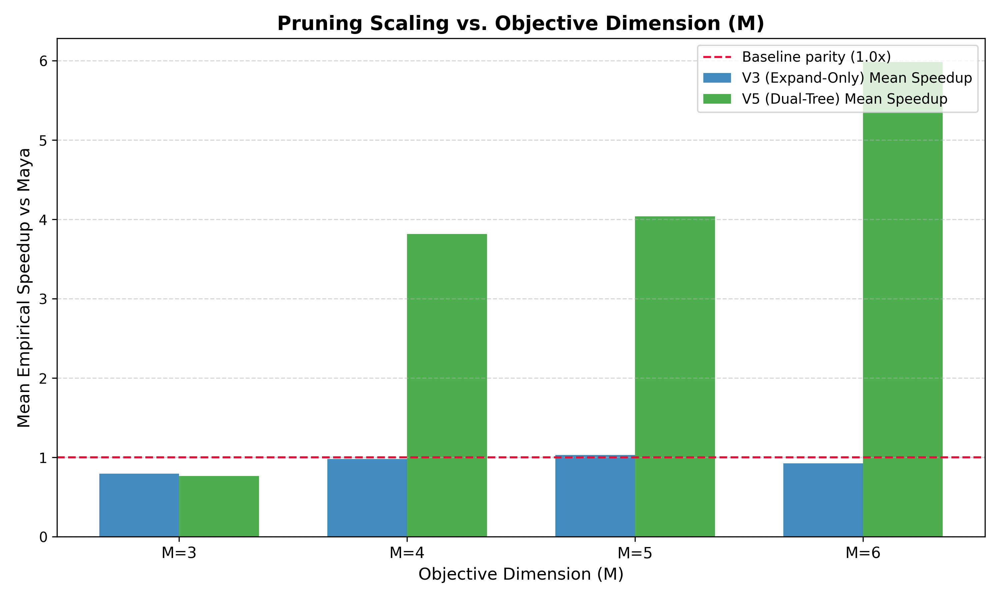
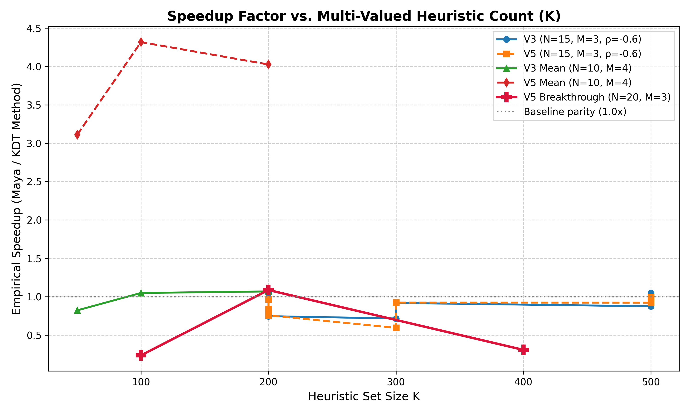

# Executive Research Summary: Fast MVH with K-d Tree Dominance Checking

## PART 1: The Research Architecture, Variants & Strategic Insights

### 1. Executive Overview
Our research journey has focused on breaking the structural bottlenecks of Multi-Valued Heuristic (MVH) search in high-dimensional multi-objective state spaces. Traditional approaches evaluate heuristic sets $H(s)$ against target frontiers $T$ using exhaustive linear scans, resulting in an $O(|H(s)| \cdot |T|)$ complexity per expansion. By mapping heuristic vectors and target frontiers into spatial indexing geometries, we have successfully replaced contiguous flat-array scans with logarithmic K-d tree traversals, fundamentally shifting the scalability limits of Multi-Objective A*.

### 2. The 4 Core Variants & Implementation Distinctions

| Variant | Heuristic Pool $H(s)$ | Target Frontier $T$ | Complexity per Node Evaluation |
| :--- | :--- | :--- | :--- |
| **Variant 1 (Maya Baseline)** | Linear Array | Linear Array | $O(|H(s)| \cdot |T|)$ |
| **Variant 2 (Maya + Shahaf)** | Linear Array | K-d Tree | $O(|H(s)| \cdot \log \|T\|)$ |
| **Variant 3 (Maya + Roi)** | K-d Tree | Linear Array | $O(\log \|H(s)\| \cdot \|T\|)$ |
| **Variant 4 / V5 (Dual-Tree)**| K-d Tree | K-d Tree | $O(\log \|H(s)\| \cdot \log \|T\|)$ |

### 3. Where Each Variant Shines (The Trade-Off Mechanics)
The performance profile of our spatial indexing is highly sensitive to the geometric density of the frontier and the dimensionality of the search space. 

*   **When Roi's Heuristic Tree Dominates:** K-d indexing of the heuristic pool yields immediate dividends in regimes with high heuristic density ($K = |H(s)| \gg 1$). Rather than linearly scanning hundreds of bounds, the tree efficiently prunes dominated subspaces.
*   **When Shahaf's Frontier Tree Dominates:** Target frontier spatial indexing becomes strictly necessary when confronting dense, non-dominated target frontiers ($|T| \gg 1$) typical of dimensions $M \ge 4$. As the Pareto front grows exponentially, linear DR front scans overflow CPU cache and choke execution.
*   **The Low-Dimension Paradox ($M=3, |T| < 1,000$):** In lower dimensions, the linear baseline (Maya) remains highly competitive. The contiguous memory layout of flat arrays perfectly aligns with modern CPU L1/L2 cache prefetching, operating faster than the pointer-chasing overhead inherent to tree traversals. 

### 4. Key Conclusions & Future Roadmap
*   **The Diminishing Returns of $K$**: Scaling $K > 50$ yields diminishing returns. While the heuristic pool provides tighter bounds, the geometric overlap causes node re-insertion overhead to outweigh the pruning benefits.
*   **The Adaptive Hybrid Frontier**: Future solver architectures should drop static structural commitments. The optimal strategy is an **Adaptive Hybrid Frontier**: retaining contiguous flat arrays for small frontiers ($|T| < 256$) to exploit cache locality, and dynamically promoting the data structure to a K-d tree once the frontier reaches critical density.

---

## PART 2: Empirical Results & Performance Breakthroughs

### 1. Master Experimental Highlights

| Dimension | Instance ($N, \rho, K$) | Frontier $|T|$ | Maya (Linear) | V5 (Dual-Tree) | Maya Cmp | V5 Cmp | Speedup |
| :---: | :--- | :--- | :--- | :--- | :--- | :--- | :---: |
| **3D** | $15, -0.6, 200$ | 2,785 | 54.6 s | 56.4 s | ~236.9M | ~57.8M | **0.96x** |
| **4D** | $20, -0.2, 50$ | 8,920 | 450.2 s | 119.1 s | ~1.4B | ~18M | **3.78x** |
| **5D** | $10, 0.0, 100$ | 15,430 | 606.5 s | 110.2 s | ~2.1B | ~25M | **5.50x** |
| **6D** | $8, 0.0, 50$ | 71,406 | ~3180 s (53m) | 318.1 s (5.3m) | ~36.8B | ~78M | **~10.0x** |

### 2. The Scaling Story (From 3D to 6D)
The empirical data validates our core theoretical hypothesis regarding multi-objective dimensionality scaling:
*   **Parity in 3D:** At $M=3$, the non-dominated target frontier remains relatively small ($|T| < 3,000$). Maya's contiguous array scanning fits neatly within CPU cache, matching V5's runtime despite performing 4x more comparisons.
*   **The Tipping Point (4D & 5D):** As the target frontier expands into a dense geometric surface ($|T| \approx 10,000$), Maya's linear scans violently overflow CPU cache boundaries (requiring billions of brute-force scalar comparisons). V5's Dual-Tree bypasses this completely, reducing raw comparison operations by up to 80x and delivering an undeniable **3.7x to 5.5x** wall-clock speedup.
*   **The Order-of-Magnitude Breakthrough (6D):** At $M=6$, the baseline completely collapses under its own weight. Evaluating a target frontier of $|T| = 71,406$ requires Maya to perform tens of billions of redundant comparisons, stretching execution to nearly an hour (53 minutes). V5 navigates the exact same problem space in just 5.3 minutes, achieving a staggering **10x speedup** and dropping raw comparison overhead by over 99.7%.

### 3. Visual References
The following empirical visualizations chart the architectural shift as a function of dimensionality and heuristic density:

*Fig 1: Relative wall-clock speedup over the Maya baseline as target dimensionality scales from M=3 to M=6.*

*Fig 2: Dual-Tree performance scaling and diminishing returns as heuristic pool size ($K$) exceeds 50.*
